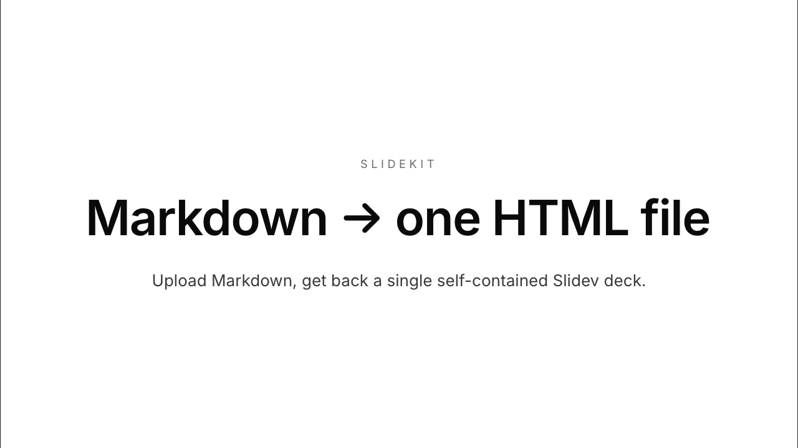

# slidekit

> [!IMPORTANT]
> **Archived on 2026-07-20.** SlideKit was merged into
> [ContentKit v1.18.0](https://github.com/MikeBild/contentkit/releases/tag/v1.18.0)
> and is no longer deployed or maintained as a standalone service. Use
> ContentKit's first-class semantic decks, deterministic information
> architecture and narrative, SVG/PNG components, self-contained Slidev
> rendering, previews, releases and site-scoped telemetry. Start with the
> [migration guide](https://github.com/MikeBild/contentkit/blob/main/docs/SLIDEKIT_MIGRATION.md)
> and [deck reference](https://github.com/MikeBild/contentkit/blob/main/docs/SLIDE_DECKS.md).

The repository remains available as the immutable history of the former
standalone implementation. Release `v1.3.0` is the final standalone release;
do not start new deployments from it. See [ARCHIVED.md](./ARCHIVED.md) for the
cutover map and operational status.

[](https://github.com/mikebild/slidekit/actions/workflows/ci.yml)


**Markdown in → one self-contained Slidev HTML out.** Upload Markdown to a tiny
HTTP API and get back a **single** HTML file with all CSS, JS and fonts inlined —
zero external requests, works offline (`file://`), with **presenter mode**. It
renders **exactly like [Slidev](https://sli.dev)**, because it runs Slidev's real
build. Packable into a single self-contained executable (no Docker).

> [!WARNING]
> Rendering runs a real Slidev/Vite build on the uploaded Markdown, which can
> **execute code** on the server. Treat input as trusted and deploy behind
> authentication. See **[SECURITY.md](./SECURITY.md)**.



_The cover of [`examples/demo.md`](./examples/demo.md) rendered with the default
`neutral` theme — the whole deck is one offline HTML file._

## Quickstart

```bash
npm install
npm run serve                 # http://localhost:4030

# render any Markdown to one self-contained HTML
curl --data-binary @examples/demo.md -H 'content-type: text/markdown' \
  'http://localhost:4030/render?theme=editorial&download=1' -o demo.html
open demo.html                # offline; presenter mode at demo.html#/presenter/1
```

Preview a deck with Slidev directly: `npm run dev` (serves `examples/demo.md`).

slidekit is distributed as source (clone + `npm install`), as prebuilt
single-file binaries attached to each GitHub Release, and as a Docker image you
build yourself:

### Docker

```bash
docker build -t slidekit .
docker run --rm -p 4030:4030 -e SLIDEKIT_API_KEYS=$KEYS slidekit
```

> Rendering executes code — run the container non-root (it does) and isolated.

### Single self-contained binary

```bash
npm run build:binary          # → dist/slidekit-deck  (embeds the runtime; no Docker)
./dist/slidekit-deck --version
PORT=4030 ./dist/slidekit-deck
```

First start extracts the embedded runtime to `~/.cache/slidekit-deck/<hash>`
(content-hashed, auto-invalidating). Builds download and checksum the pinned
official Node.js 22.23.1 runtime, avoiding dependencies on a local Homebrew or
system Node installation. The binary is platform-specific — build it
on the OS/arch you run on.

Prebuilt binaries for macOS (arm64) and Linux (x64/arm64) are attached to each
[GitHub Release](https://github.com/mikebild/slidekit/releases) alongside
`SHA256SUMS`. On macOS, clear the download quarantine first:
`xattr -d com.apple.quarantine ./slidekit-macos-arm64`.

## API

| Method | Path                               | Purpose                                       |
| ------ | ---------------------------------- | --------------------------------------------- |
| `GET`  | `/`                                | JSON service descriptor                       |
| `POST` | `/render`                          | Markdown body → one self-contained HTML deck  |
| `GET`  | `/themes`                          | JSON list of theme names                      |
| `GET`  | `/openapi.json`                    | OpenAPI 3.1 spec (generated)                  |
| `GET`  | `/health`                          | Liveness probe                                |
| `GET`  | `/ready`                           | Readiness and exact service version           |
| `GET`  | `/metrics`                         | Prometheus metrics (requests, builds, cache)  |
| `GET`  | `/v1/stats/builds`                 | Authenticated hourly product statistics       |
| `GET`  | `/jobs/{id}` · `/jobs/{id}/result` | Async job status + result deck                |
| `GET`  | `/llms.txt` · `/llms-full.txt`     | LLM docs ([llmstxt.org](https://llmstxt.org)) |

`POST /render` takes the Markdown as the request body
(`content-type: text/markdown`), or a `multipart/form-data` file field
(`file`/`markdown`/`md`), plus optional query params:

| param                            | effect                                                                                         |
| -------------------------------- | ---------------------------------------------------------------------------------------------- |
| `theme`                          | theme name (see `/themes`); unknown → default                                                  |
| `title`                          | `<title>` + `og:title`/`twitter:title` + download filename                                     |
| `author`                         | `meta[name=author]`                                                                            |
| `tags`                           | comma-separated → `meta[name=keywords]`                                                        |
| `description`                    | meta description + `og`/`twitter` description                                                  |
| `image` · `imageAlt`             | social image URL + alt → `og:image`/`twitter:image`                                            |
| `url` · `siteName` · `locale`    | `og:url` (+ canonical) / `og:site_name` / `og:locale`                                          |
| `lang` · `robots` · `themeColor` | `<html lang>` / `meta[robots]` / `meta[theme-color]`                                           |
| `twitterSite` · `twitterCreator` | `twitter:site` / `twitter:creator` (@handles)                                                  |
| `favicon`                        | inline favicon — emoji/short text (→ SVG) or a `data:` URI (stays offline)                     |
| `download=1`                     | respond with `Content-Disposition: attachment`                                                 |
| `async=1`                        | enqueue the build → `202` + a job to poll at `/jobs/{id}`                                      |
| `callback`                       | async webhook URL (`POST {id,status}` on completion; host must be in `SLIDEKIT_WEBHOOK_ALLOW`) |

Responses carry a strong **`ETag`** (→ `304` on `If-None-Match`), identical
renders are served from an in-memory **cache**, and text/JSON responses are
**gzip**-compressed on `Accept-Encoding`.

When `SLIDEKIT_API_KEYS` is set, `/render` and `/jobs/*` require a valid key via
`Authorization: Bearer <key>` or `X-API-Key: <key>`.

`GET /v1/stats/builds?from=<UTC-hour>&to=<UTC-hour>` reuses the same service key
and returns bounded hourly build, render, cache and async-job statistics. It is
unavailable when service authentication is not configured. Aggregate state is
kept under the platform state directory and never contains Markdown, deck names,
URLs, job IDs or credentials.

## Configuration

All configuration is via environment variables (optionally a `.env` file — see
[`.env.example`](./.env.example)). Highlights: `PORT`, `HOST`,
`SLIDEKIT_API_KEYS`, `SLIDEKIT_RATE_LIMIT_MAX`, `SLIDEKIT_MAX_BODY_BYTES`,
`SLIDEKIT_BUILD_TIMEOUT_MS`, `LOG_LEVEL`/`LOG_FORMAT`. Full reference:
**[docs/CONFIGURATION.md](./docs/CONFIGURATION.md)**.

## Themes & icons

Themes are CSS overlay files in `themes/<name>.css`, selected per request via
`?theme=`. Built-in: `neutral` (shadcn-style, light/dark) and `editorial` (warm,
indigo); drop in a new file and it appears in `/themes` and the
OpenAPI enum. Fonts (Inter + JetBrains Mono, both [SIL OFL 1.1](https://openfontlicense.org))
are base64-inlined in the committed `fonts.css` so rendered decks and builds need
no network; regenerate it with `node gen-fonts.mjs`. Decks can use bundled
icons — Material Symbols (`<material-symbols-key-outline />`), Carbon, Phosphor.

**Full guide → [docs/THEMING-AND-ICONS.md](./docs/THEMING-AND-ICONS.md)**:
the two-layer model, design tokens, light/dark, custom themes, and icons.

## Development

```bash
npm test                 # fast unit tests (node:test)
npm run test:coverage    # unit tests with a coverage report (c8)
npm run test:integration # slower: renders a real deck end-to-end
npm run lint             # ESLint
npm run format           # Prettier
```

Architecture overview: [docs/ARCHITECTURE.md](./docs/ARCHITECTURE.md).
Deployment guide: [docs/DEPLOYMENT.md](./docs/DEPLOYMENT.md).

## Contributing

This repository is read-only. Continue deck work in
[ContentKit](https://github.com/MikeBild/contentkit).

## License

[MIT](./LICENSE) © Mike Bild
