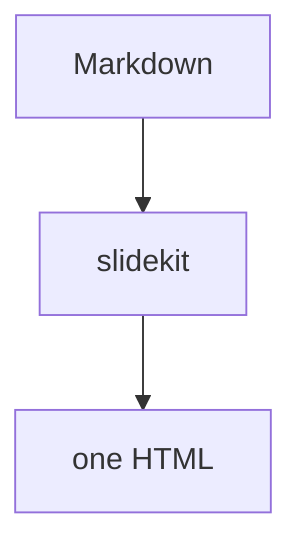

# Theming & Icons

How to control the look of decks rendered by slidekit, and how to use icons
(Material Symbols and others) in your Markdown.

## The two-layer model

slidekit renders every deck with a **fixed Slidev base theme** plus a **slidekit
CSS overlay**:

```
your Markdown
  └─ Slidev base theme   ← fixed by the server (SLIDEKIT_BASE_THEME, default `seriph`)
       └─ CSS overlay     ← chosen per request via ?theme=<name>  (neutral | editorial | …)
            └─ one self-contained HTML
```

- The **base theme** provides Slidev's layouts/behaviour. slidekit pins it so the
  build is reproducible and can't break. **A `theme:` key in your deck's
  frontmatter is normalized to the base theme** — see
  [Why your deck's `theme:` is ignored](#why-your-decks-theme-is-ignored).
- The **overlay** is a CSS file that paints the palette, typography, borders and
  accent. This is what you select with `?theme=`. It's _not_ a Slidev theme
  package.

> **Two different "theme" words.** `?theme=` (query param / upload field) = a
> slidekit **CSS overlay**. `theme:` (Markdown frontmatter) = a **Slidev npm
> theme package**. They are unrelated; only the overlay affects the look.

## Built-in overlays

| Overlay             | Look                                     | Accent (light / dark)        |
| ------------------- | ---------------------------------------- | ---------------------------- |
| `neutral` (default) | shadcn-style neutral, white / near-black | teal `#14b8a6` / `#2dd4bf`   |
| `editorial`         | warm paper / espresso, bolder headings   | indigo `#4f46e5` / `#818cf8` |

Select one per request:

```bash
curl --data-binary @deck.md -H 'content-type: text/markdown' \
  'http://localhost:4030/render?theme=editorial' -o deck.html
```

`GET /themes` returns the live list (it's read from the themes directory), and
the OpenAPI `theme` enum is populated from it automatically.

## Design tokens

Each overlay defines CSS variables on `:root` (light) and `html.dark` (dark).
Everything else references these tokens, so a new theme is mostly a matter of
picking values.

| Token                    | Purpose                                      |
| ------------------------ | -------------------------------------------- |
| `--c-bg`                 | slide background                             |
| `--c-fg`                 | foreground / text                            |
| `--c-muted`              | muted/secondary text                         |
| `--c-border`             | card & divider borders (via `.border-token`) |
| `--c-accent`             | accent (links, icons, highlights)            |
| `--slidev-theme-primary` | Slidev's primary var, set to `--c-accent`    |

The overlay also:

- sets the canvas + Inter typography on `.slidev-layout` and headings,
- neutralizes the seriph **cover** background,
- exposes a `.border-token` class for token-driven borders,
- **maps authored accent utilities onto the theme accent** — `text-teal-400/500/600`,
  `border-teal-500/600` and `bg-teal-9xx` are remapped to `--c-accent`. So a deck
  authored with `text-teal-500` automatically follows whichever overlay is active.

## Light & dark

Add `colorSchema: all` to your deck's frontmatter to ship both palettes and the
in-deck light/dark toggle (Slidev toolbar, bottom-left). The overlay's `:root`
and `html.dark` token blocks switch automatically. The rendered file is fully
self-contained, so the toggle works offline.

## Fonts

Fonts are **base64-inlined** (`fonts.css`: Inter + JetBrains Mono), so output has
**zero external font requests**. To keep it that way, set `provider: none` in your
deck so Slidev doesn't add a Google Fonts `<link>`:

```yaml
fonts:
  sans: Inter
  serif: Inter
  mono: JetBrains Mono
  provider: none
```

(The server also strips any external font `<link>` as a safety net.) Regenerate
`fonts.css` with `node gen-fonts.mjs` (needs network once) if you change the font
set.

## Add a custom overlay theme

1. Create `themes/<name>.css` using the token pattern below.
2. It appears automatically in `GET /themes` and the OpenAPI enum.
3. If you run the **binary**, rebuild it (`npm run build:binary`) so the theme is
   in the embedded payload — or point `SLIDEKIT_THEMES_DIR` at an external folder.

Minimal template (`themes/mybrand.css`):

```css
/* Theme: mybrand */
@import '../fonts.css';

:root {
  --c-bg: #ffffff;
  --c-fg: #0b1020;
  --c-muted: #5b6472;
  --c-border: #e6e8ee;
  --c-accent: #2563eb; /* your brand accent */
  --slidev-theme-primary: var(--c-accent);
}
html.dark {
  --c-bg: #0b1020;
  --c-fg: #e8ebf2;
  --c-muted: #9aa3b2;
  --c-border: #222a3a;
  --c-accent: #60a5fa;
}

.slidev-layout {
  background-color: var(--c-bg);
  color: var(--c-fg);
  font-family: 'Inter', ui-sans-serif, system-ui, sans-serif;
  -webkit-font-smoothing: antialiased;
}
.slidev-layout.cover,
.slidev-layout.intro {
  background-image: none !important;
  background-color: var(--c-bg) !important;
  color: var(--c-fg) !important;
}
.slidev-layout :is(h1, h2, h3, h4) {
  color: var(--c-fg);
  font-weight: 600;
  letter-spacing: -0.02em;
}
.border-token {
  border-color: var(--c-border) !important;
}
.slidev-layout a {
  color: var(--c-accent);
}

/* make authored accent utilities follow this theme */
.slidev-layout :is(.text-teal-400, .text-teal-500, .text-teal-600) {
  color: var(--c-accent) !important;
}
.slidev-layout :is(.border-teal-500, .border-teal-600) {
  border-color: var(--c-accent) !important;
}
.slidev-layout :is([class*='bg-teal-9']) {
  background-color: color-mix(in srgb, var(--c-accent) 10%, transparent) !important;
}

.slidev-layout svg {
  vertical-align: -0.18em;
} /* optical icon alignment */
```

## Configuration

| Env var                  | Purpose                                       | Default         |
| ------------------------ | --------------------------------------------- | --------------- |
| `SLIDEKIT_DEFAULT_THEME` | overlay used when `?theme=` is absent/unknown | `neutral`       |
| `SLIDEKIT_BASE_THEME`    | Slidev base theme (installed npm theme)       | `seriph`        |
| `SLIDEKIT_THEMES_DIR`    | directory of `*.css` overlays                 | `<root>/themes` |

### Why your deck's `theme:` is ignored

slidekit normalizes the top-level `theme:` in your frontmatter to
`SLIDEKIT_BASE_THEME`. This is deliberate: `theme:` is a _Slidev npm package_, and
an uninstalled one (including the overlay names `neutral`/`editorial`, or any
theme not bundled) would make the offline build fail. Normalizing it means **any
deck renders regardless of its `theme:`**, and the look is controlled by the
overlay. To change the base theme globally, install it and set
`SLIDEKIT_BASE_THEME` (only `seriph` and `default` are bundled).

---

# Icons

Icons are rendered by Slidev via [Iconify](https://iconify.design) — you write
them as components in Markdown and the SVG is inlined (no network at view time).

## Bundled collections

| Collection           | Prefix             | Notes                                                         |
| -------------------- | ------------------ | ------------------------------------------------------------- |
| **Material Symbols** | `material-symbols` | the primary set (16k+ icons), an explicit slidekit dependency |
| Carbon               | `carbon`           | bundled via Slidev's default theme                            |
| Phosphor             | `ph`               | bundled via Slidev                                            |
| Spinners             | `svg-spinners`     | animated loaders, bundled via Slidev                          |

Only `material-symbols` is guaranteed (it's a direct dependency); the others come
in transitively with Slidev. **Use a collection that is installed** — an
uninstalled one fails the build (same failure mode as an unknown theme).

## Using an icon

Write `<{prefix}-{icon-name} />` anywhere in your Markdown:

```md
<material-symbols-key-outline />
<material-symbols-link />
<carbon-rocket />
```

Material Symbols ships style variants — append `-outline`, `-rounded`, or
`-sharp` (the bare name is the filled style):

```md
<material-symbols-bolt /> <!-- filled -->
<material-symbols-bolt-outline />
<material-symbols-bolt-rounded />
```

Find exact names at [icones.js.org](https://icones.js.org) or
[icon-sets.iconify.design](https://icon-sets.iconify.design) — pick the
collection and copy the `prefix-name`.

## Styling icons

Icons are normal elements: color comes from `currentColor`, size from font-size.
UnoCSS/Tailwind utilities work directly:

```md
<material-symbols-shield-outline class="text-teal-500 text-2xl" />
<material-symbols-trending-up class="text-3xl mr-1" />
```

Because overlays map `text-teal-*` onto the theme accent, coloring an icon
`text-teal-500` makes it **follow the active theme's accent** (teal in `neutral`,
indigo in `editorial`). Inline `style` also works:
`<material-symbols-link style="color:#14b8a6;font-size:2rem" />`.

## MDC inline form

In decks with `mdc: true`, you can place icons inline in prose with the MDC
component syntax (dot-chained classes):

```md
Secrets are kept safe :material-symbols-lock-outline{.text-teal-500} centrally.
```

Inside a raw `<div>` block, use the component form (`<material-symbols-… />`); the
`:icon{}` shorthand is only parsed in Markdown prose, not inside raw HTML.

## Add another icon collection

1. Install it: `npm i @iconify-json/<collection>` (e.g. `lucide`, `mdi`,
   `tabler`).
2. Rebuild the binary (`npm run build:binary`) so it's in the payload, or ensure
   it's in `node_modules` for the Node service.
3. Use it: `<lucide-rocket />`.

---

# Writing decks for slidekit — checklist

- Add `colorSchema: all` for the light/dark toggle.
- Set `fonts: { provider: none }` to stay fully offline.
- Don't rely on `theme:` — it's normalized; choose the look via `?theme=`.
- Use `text-teal-*` for accents so they follow the chosen overlay.
- Use bundled icons (`material-symbols`, `carbon`, `ph`, `svg-spinners`).
- Slidev features work as usual: layouts (`two-cols`, `::right::`), `v-clicks`,
  `mermaid`, KaTeX, UnoCSS/Tailwind utility classes, transitions.

Example slide:

````md
---
layout: two-cols
colorSchema: all
fonts:
  provider: none
---

# Before

<v-clicks>

- <material-symbols-link class="text-teal-500" /> APIs
- <material-symbols-lock-outline class="text-teal-500" /> Secrets

</v-clicks>

::right::

# After


````

```

```
