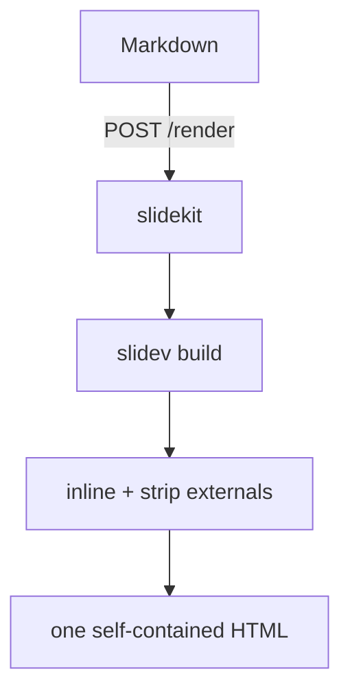

<div class="text-sm uppercase tracking-[0.3em] opacity-60 mb-4">slidekit</div>

# Markdown → one HTML file

<div class="text-xl opacity-80 mt-6">
Upload Markdown, get back a single self-contained Slidev deck.
</div>

---
layout: default
---

# What you get

<div class="grid grid-cols-2 gap-x-10 gap-y-4 mt-8 text-lg">

<div><b class="text-teal-500">Self-contained</b> — CSS, JS and fonts inlined</div>
<div><b class="text-teal-500">Offline</b> — opens straight from <code>file://</code></div>
<div><b class="text-teal-500">Presenter mode</b> — notes + next-slide preview</div>
<div><b class="text-teal-500">Themes</b> — swappable per request</div>

</div>

<div class="mt-10 text-base opacity-70 border-t border-token pt-5">
It renders <b>exactly like Slidev</b>, because it runs Slidev's real build.
</div>

---
layout: two-cols
layoutClass: gap-10
---

# Before

<div class="mt-4 space-y-2 text-sm opacity-80">

- A multi-file SPA you have to host
- External font + asset requests
- No single artifact to hand off

</div>

::right::

# After

<div class="mt-4 space-y-2 text-sm">

<v-clicks>

- One `.html` file
- Zero external requests
- Email it, commit it, open it anywhere

</v-clicks>

</div>

---
layout: two-cols
layoutClass: gap-10
---

# How it flows

The service runs a real Slidev/Vite build and inlines everything into one file.

<div class="mt-5 text-sm opacity-80">
Themes, fonts and config are bundled; your Markdown is the only input.
</div>

::right::

<div class="mt-16"></div>



---
layout: default
---

# Code renders too

```ts
// POST raw Markdown, get one HTML deck back
const res = await fetch('http://localhost:4030/render?theme=editorial&download=1', {
  method: 'POST',
  headers: { 'content-type': 'text/markdown' },
  body: markdown,
})
const html = await res.text() // fully self-contained
```

<div class="mt-6 text-base opacity-70">
Pass <code>?theme=</code>, <code>?title=</code>, <code>?author=</code>, <code>?tags=</code>,
<code>?description=</code>, <code>?image=</code> to control output and meta tags.
</div>

---
layout: center
class: text-center
---

# slidekit

<div class="text-lg opacity-80 mt-4">
Markdown in, one self-contained Slidev deck out.
</div>
